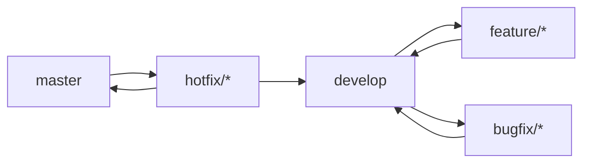

# 🤝 Contributing to Helix AI

Welcome! 👋

We're excited that you're interested in contributing to **Helix AI** — a futuristic personal assistant designed to unify, simplify, and empower. Whether you're fixing a bug, adding a feature, or improving the docs, we appreciate your help in making Helix even better.
We're excited that you're interested in contributing to **Helix AI** — a futuristic personal assistant designed to unify, simplify, and empower. Whether you're fixing a bug, adding a feature, or improving the docs, we appreciate your help in making Helix even better.

---

## 📦 Getting Started

1. **Fork** the repository.
2. **Clone** your fork:

   ```bash
   git clone https://github.com/your-username/helix-ai.git
   cd helix-ai
   ```

3. **Install dependencies**:

   ```bash
   npm install
   ```

4. **Create a new branch** (from `develop`):

5. **Create a new branch** (from `develop`):

   ```bash
   git checkout -b feature/my-feature
   git checkout -b feature/my-feature
   ```

---

## 🔀 Git Flow Branching Model

We follow the standard Git Flow model to organize our work:



- **develop**: Main integration branch for ongoing work.
- **master**: Stable production branch (releases are tagged here).
- **feature/**\*: New features branched off **develop**.
- **bugfix/**\*: Non-critical fixes branched off **develop**.
- **hotfix/**\*: Critical production fixes branched off **master**.
- **docs/**\*: Documentation updates branched off **develop**.

---

## 📜 Commit Conventions & Prefixes

We enforce Conventional Commits via CI to maintain a clear, machine-readable changelog.

```text
Allowed Types: feat | fix | docs | style | refactor | perf | test | build | ci | chore | revert | merge

Branch Prefixes:
  feature/*
  bugfix/*
  hotfix/*
  docs/*

Conventional Commits enforced via CI with @commitlint/config-conventional.
```

---

## ✅ Pull Request Process

1. **Branch Creation**: From `develop`, create a branch following prefix guidelines.
2. **Work and Commit**: Make atomic commits with clear messages; run `npm run lint` and `npm run test` locally.
3. **Open PR**: Target `develop`. Fill out the PR template, link related issues, include screenshots for UI changes.
4. **Automated Checks**: CI runs tests, lint, type checks, and commitlint rules.
5. **Code Review**: Reviewers (automatically assigned) and GitHub Copilot provide feedback. Address comments and push updates.
6. **Merge Strategy**: Once approved, use **Squash and merge** to keep history clean. The merge commit will be included in the changelog.
7. **Post-Merge**: Delete the branch on GitHub. Semantic-release will pick up merged commits for versioning.
8. **Monitoring**: Verify changes in the `develop` environment. Create hotfix branches from `master` if urgent issues arise.

---

## 📦 Release & Versioning

- **No `release/` branches**: Versioning is fully automated.
- **semantic-release** analyzes commits on `master` to bump versions according to Conventional Commit types.
- **Changesets** manage release notes and version control in multi-package repos.
- On merge to `master`, CI runs `semantic-release` to publish packages, create GitHub releases, and update the changelog.
- Tags (`vX.Y.Z`) are generated automatically and pushed to GitHub.
- Hotfixes branched off `master` must be merged back into both `master` and `develop`.

---

## 🛠️ Automated Dependency & Linting Tooling

- **Renovate** - automates dependency updates by grouping PRs and auto-merging safe upgrades.
- **Dependabot** - GitHub's security scanner that generates PRs for vulnerability fixes and lockfile updates.
- **Husky** + **Lint-Staged** - runs pre-commit hooks to:
  - `eslint --fix` and `prettier --write` on staged files.
  - Prevent formatting and lint errors before push.

- **ESLint** - enforces static analysis with a shared config plus custom rules.
- **Prettier** - code formatting (semicolons, single quotes, print width, Tailwind plugin).
- **Commitlint** - validates Conventional Commits via `@commitlint/config-conventional`, enforced in CI.
- **TypeScript (strict mode)** - full type-safety; no `@ts-expect-error` without justification.

## 🔀 Git Flow Branching Model

We follow the standard Git Flow model to organize our work:


- **develop**: Main integration branch for ongoing work.
- **master**: Stable production branch (releases are tagged here).
- **feature/**\*: New features branched off **develop**.
- **bugfix/**\*: Non-critical fixes branched off **develop**.
- **hotfix/**\*: Critical production fixes branched off **master**.
- **docs/**\*: Documentation updates branched off **develop**.

---

## 📜 Commit Conventions & Prefixes

We enforce Conventional Commits via CI to maintain a clear, machine-readable changelog.

```text
Allowed Types: feat | fix | docs | style | refactor | perf | test | build | ci | chore | revert | merge

Branch Prefixes:
  feature/*
  bugfix/*
  hotfix/*
  docs/*

Conventional Commits enforced via CI with @commitlint/config-conventional.
```

---

## ✅ Pull Request Process

1. **Branch Creation**: From `develop`, create a branch following prefix guidelines.
2. **Work and Commit**: Make atomic commits with clear messages; run `npm run lint` and `npm run test` locally.
3. **Open PR**: Target `develop`. Fill out the PR template, link related issues, include screenshots for UI changes.
4. **Automated Checks**: CI runs tests, lint, type checks, and commitlint rules.
5. **Code Review**: Reviewers (automatically assigned) and GitHub Copilot provide feedback. Address comments and push updates.
6. **Merge Strategy**: Once approved, use **Squash and merge** to keep history clean. The merge commit will be included in the changelog.
7. **Post-Merge**: Delete the branch on GitHub. Semantic-release will pick up merged commits for versioning.
8. **Monitoring**: Verify changes in the `develop` environment. Create hotfix branches from `master` if urgent issues arise.

---

## 📦 Release & Versioning

- **No `release/` branches**: Versioning is fully automated.
- **semantic-release** analyzes commits on `master` to bump versions according to Conventional Commit types.
- **Changesets** manage release notes and version control in multi-package repos.
- On merge to `master`, CI runs `semantic-release` to publish packages, create GitHub releases, and update the changelog.
- Tags (`vX.Y.Z`) are generated automatically and pushed to GitHub.
- Hotfixes branched off `master` must be merged back into both `master` and `develop`.

---

## 🛠️ Automated Dependency & Linting Tooling

- **Renovate** - automates dependency updates by grouping PRs and auto-merging safe upgrades.
- **Dependabot** - GitHub's security scanner that generates PRs for vulnerability fixes and lockfile updates.
- **Husky** + **Lint-Staged** - runs pre-commit hooks to:
  - `eslint --fix` and `prettier --write` on staged files.
  - Prevent formatting and lint errors before push.

- **ESLint** - enforces static analysis with a shared config plus custom rules.
- **Prettier** - code formatting (semicolons, single quotes, print width, Tailwind plugin).
- **Commitlint** - validates Conventional Commits via `@commitlint/config-conventional`, enforced in CI.
- **TypeScript (strict mode)** - full type-safety; no `@ts-expect-error` without justification.

---

## 🧪 Testing

Ensure your code passes tests and linting before submitting a pull request:
Ensure your code passes tests and linting before submitting a pull request:

```bash
npm run lint
npm run test
```

---

## 📁 Project Structure

- `src/` — Application source code
- `user-interfaces/frontend/src/app/Docs` — Documentation content (MDX and pages)
- `src/` — Application source code
- `user-interfaces/frontend/src/app/Docs` — Documentation content (MDX and pages)
- `components/` — Reusable UI pieces
- `constants/` — Centralized config and metadata
- `.github/` — Issue templates, workflows, labels

---

## 🧾 Pull Request Checklist

- [ ] Scoped to a single feature or fix
- [ ] Includes tests (if applicable)
- [ ] Ran `npm run lint` and `npm run test`
- [ ] Updated documentation where necessary
- [ ] Commit messages follow Conventional Commits format
- [ ] Scoped to a single feature or fix
- [ ] Includes tests (if applicable)
- [ ] Ran `npm run lint` and `npm run test`
- [ ] Updated documentation where necessary
- [ ] Commit messages follow Conventional Commits format

---

## 🏷️ Labels & Issues

## 🏷️ Labels & Issues

We use GitHub labels and `.github/labeler.yml` to automatically categorize issues and PRs:
We use GitHub labels and `.github/labeler.yml` to automatically categorize issues and PRs:

- `bug`, `enhancement`, `documentation`
- `discord-bot/*`, `api/*`, `ux/*`, etc.

---

## 📜 License

Contributions are accepted under the [Helix AI Custom Open License](LICENSE.md). By submitting code, you agree that your contributions may be used under this license.

---

## ❤️ Thank You

## ❤️ Thank You

Your help makes Helix AI smarter, more resilient, and more human. We appreciate every suggestion, commit, and line of feedback.

Need help? Join us on [Discord](https://discord.gg/Za8MVstYnr).

—
**The Helix AI Team**
