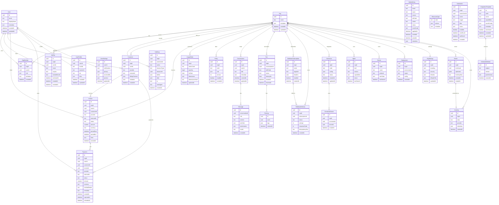

# Entities

```mermaid
erDiagram

%% ===== Core Tenants =====
Org {
  uuid id
  text name
  json metadata
  datetime createdAt
  datetime updatedAt
}
OrgMember {
  uuid id
  uuid orgId
  uuid userId
  text role
  json attributes
  datetime createdAt
}

%% ===== User Profile & Settings =====
User {
  uuid id
  text email
  text displayName
  json metadata
  datetime createdAt
  datetime updatedAt
}

UserProfile {
  uuid id
  uuid userId
  text handle
  text avatarUrl
  text bio
  json links
  datetime createdAt
  datetime updatedAt
}

UserSettings {
  uuid id
  uuid userId
  json notifications
  json privacy
  json accessibility
  json product
  datetime updatedAt
}

OrgSettings {
  uuid id
  uuid orgId
  json branding
  json security
  json defaults
  json billingPrefs
  datetime updatedAt
}

%% ===== Growth / Waitlist =====
WaitlistEntry {
  uuid id
  text email
  text name
  text source
  text refCode
  text cohort
  text status
  text inviteCode
  datetime appliedAt
  datetime invitedAt
  datetime joinedAt
  json metadata
}

%% ===== Governance / Security =====
ApiKey {
  uuid id
  uuid orgId
  uuid userId
  text name
  text scopes
  text hashedSecret
  datetime lastUsedAt
  datetime createdAt
  datetime revokedAt
}
AuditLog {
  uuid id
  uuid orgId
  uuid actorUserId
  text action
  text resourceType
  uuid resourceId
  json before
  json after
  text ip
  text userAgent
  datetime createdAt
}
Secret {
  uuid id
  uuid orgId
  uuid kmsKeyId
  bytes ciphertext
  text kmsKeyAlias
  datetime createdAt
  datetime rotatedAt
}
KmsKey {
  uuid id
  uuid orgId
  text alias
  text provider
  json metadata
  datetime createdAt
}

%% ===== Billing / Metering =====
Customer {
  uuid id
  uuid orgId
  uuid userId
  text provider
  text externalId
  json billingContacts
  json metadata
  datetime createdAt
}

UsageMeter {
  uuid id
  uuid orgId
  text metricCode
  bigint quantity
  date forDate
  json dimensions
  text dimensionsHash
  datetime updatedAt
}

Invoice {
  uuid id
  uuid orgId
  uuid userId
  uuid customerId
  text provider
  text externalId
  text status
  numeric amount
  text currency
  datetime periodStart
  datetime periodEnd
  json lines
  datetime createdAt
}

Payment {
  uuid id
  uuid orgId
  uuid userId
  uuid customerId
  uuid invoiceId
  text provider
  text externalId
  text status
  numeric amount
  text currency
  json methodDetails
  json metadata
  datetime createdAt
  datetime capturedAt
  datetime refundedAt
}

%% ===== ABAC Extensions =====
Policy {
  uuid id
  uuid orgId
  text code
  json rule
  int version
  boolean enabled
  datetime createdAt
}
ResourceType {
  text code
  json actions
  json metadata
}

%% ===== Assistant / Automations =====
Conversation {
  uuid id
  uuid orgId
  uuid userId
  text title
  json metadata
  datetime createdAt
  datetime updatedAt
}
Message {
  uuid id
  uuid conversationId
  text role
  text content
  json toolCalls
  json attachments
  text model
  datetime createdAt
}
Run {
  uuid id
  uuid orgId
  uuid conversationId
  text skillCode
  text status
  float latencyMs
  datetime startedAt
  datetime finishedAt
}
RunLog {
  uuid id
  uuid runId
  json logs
  datetime createdAt
}
Automation {
  uuid id
  uuid orgId
  uuid ownerUserId
  text name
  json trigger
  json filter
  json action
  boolean enabled
  datetime nextRunAt
  datetime lastRunAt
  datetime createdAt
}
WebhookSubscription {
  uuid id
  uuid orgId
  text event
  text targetUrl
  json headers
  boolean enabled
  datetime createdAt
}
WebhookDelivery {
  uuid id
  uuid orgId
  uuid subscriptionId
  text status
  int attempt
  int responseCode
  text idempotencyKey
  datetime createdAt
}

%% ===== Integrations & Schema =====
Connector {
  uuid id
  uuid orgId
  text code
  json config
  text status
  datetime createdAt
  datetime updatedAt
}
IntegrationTemplate {
  uuid id
  text code
  text name
  json capabilities
  json oauthConfig
  json metadata
  boolean isArchived
  datetime createdAt
  datetime updatedAt
}
SchemaDefinition {
  uuid id
  text subject
  int version
  json jsonSchema
  datetime createdAt
}
ConnectorSecret {
  uuid id
  uuid orgId
  uuid connectorId
  uuid secretId
  datetime createdAt
}

%% ===== Edge / IoT =====
Agent {
  uuid id
  uuid orgId
  text kind
  text version
  json capabilities
  text status
  datetime lastSeenAt
}
Device {
  uuid id
  uuid orgId
  text name
  text protocol
  json twinState
  datetime lastSeenAt
}
Deployment {
  uuid id
  uuid orgId
  text environment
  text region
  json config
  datetime createdAt
}

%% ===== Relationships =====

%% --- Core Tenancy ---
Org  ||--o{ OrgMember : has
User ||--o{ OrgMember : joins

%% --- Governance / Security ---
Org  ||--o{ ApiKey : issues
User ||--o{ ApiKey : owns
Org  ||--o{ AuditLog : records
Secret ||--o| KmsKey : protected_by

%% --- Billing / Metering ---
Org       ||--o{ Customer : bills_as
User      ||--o{ Customer : is_customer
Customer  ||--o{ Invoice  : invoices
Customer  ||--o{ Payment  : payments
Org       ||--o{ Invoice  : invoices
User      ||--o{ Invoice  : billed
Invoice   ||--o{ Payment  : has
User      ||--o{ Payment  : pays
Org       ||--o{ UsageMeter : measures

%% --- ABAC / Policy ---
Org  ||--o{ Policy : abac

%% --- Assistant / Automations ---
Org           ||--o{ Conversation : chats
Conversation  ||--o{ Message : has
Org           ||--o{ Run : executions
Run           ||--o{ RunLog : has
Org           ||--o{ WebhookSubscription : subscribes
WebhookSubscription ||--o{ WebhookDelivery : delivers
Org           ||--o{ WebhookDelivery : owns

%% --- Integrations & Schema ---
Org                  ||--o{ Connector : integrates
Connector            ||--o{ ConnectorSecret : uses
IntegrationTemplate  ||--o{ SchemaDefinition : versions

%% --- Edge / IoT ---
Org ||--o{ Agent : runs
Org ||--o{ Device : owns
Org ||--o{ Deployment : has

%% --- Profiles & Settings ---
User ||--|| UserProfile : profile
User ||--|| UserSettings : settings
Org  ||--|| OrgSettings  : settings

%% --- Governance / Security (extras) ---
Org  ||--o{ Secret : stores
Org  ||--o{ KmsKey : owns


```
