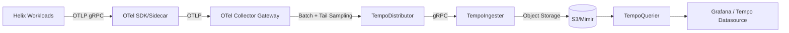
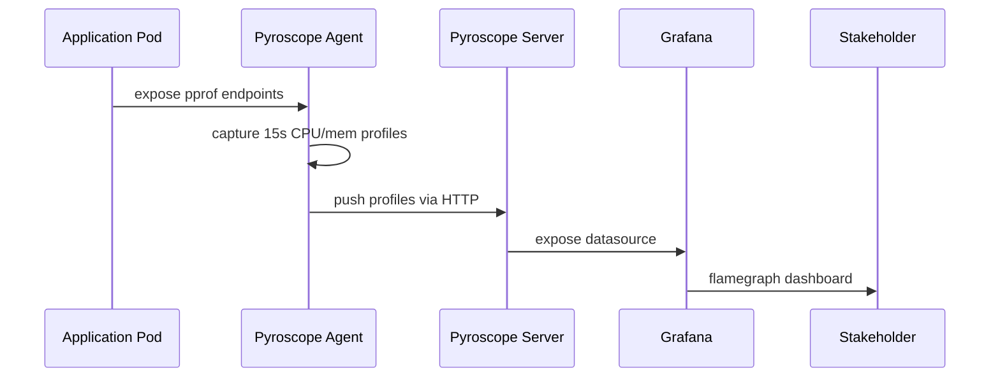
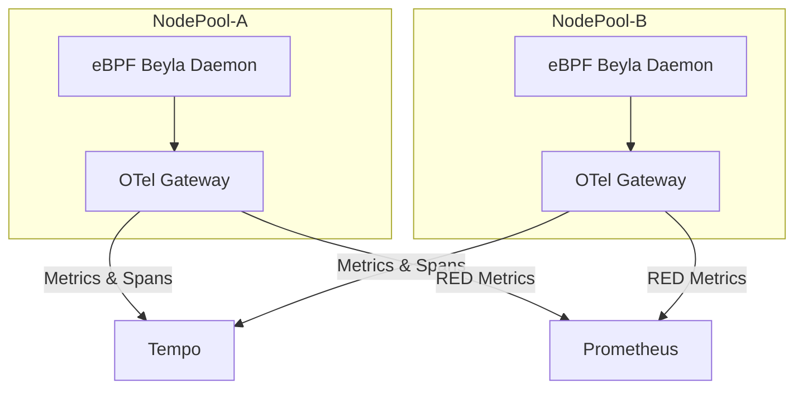

# Observability GA Rollout Plan (PR #148)

_Last updated: 2025-11-28_

## A. Executive Summary

Helix is standardizing observability across every Kubernetes environment so that platform, SRE, and product teams can drive GA readiness with the same telemetry vocabulary. This plan sequences the delivery of metrics, logs, traces, profiling, and response tooling in three bounded phases, each with explicit promotion gates and audit evidence. The scope spans the dev (`dev-usw2-helix`), staging (`stg-usw2-helix`), and production (`prod-usw2-helix` and `prod-euw1-helix`) clusters managed via Flux.

### Environmental Scope Matrix

| Environment | Clusters                             | Observability Span                        | Rollout Captain                | Promotion Window                            |
| ----------- | ------------------------------------ | ----------------------------------------- | ------------------------------ | ------------------------------------------- |
| Dev         | `dev-usw2-helix`                     | Single AZ, non-HA control plane           | Platform Enablement (Marin K.) | Daily 14:00 UTC                             |
| Staging     | `stg-usw2-helix`                     | Multi-AZ control plane, Istio canary mesh | SRE Readiness (Ivy R.)         | Tue/Thu 16:00 UTC                           |
| Production  | `prod-usw2-helix`, `prod-euw1-helix` | Multi-region HA clusters + DR             | Platform SRE (Ama L.)          | Wed 18:00 UTC (primary), Sun 08:00 UTC (DR) |

### Required Outcomes

1. **Unified Telemetry Fabric** – Prometheus, Loki, Tempo, Pyroscope, and Grafana components operate as a single mesh with Flux-delivered config.
2. **Actionable Dashboards & Alerts** – Every SLO referenced by GA launch criteria has a dashboard, alert rule, and Grafana OnCall route.
3. **Operational Runbooks** – Each surface ships with a runbook stored under `Docs/infra/runbooks/<component>.md` and linked from Grafana.
4. **Promotion Evidence** – Phase gates rely on recorded checks (dashboards, load runs, mesh health) attached to GitHub issues before advancing clusters.

---

## B. Phase 1 – Core Monitoring & Metrics

Phase 1 establishes the baseline telemetry pillar (kube-prometheus-stack, Kiali, Loki, Grafana Mimir) and validates mesh visibility plus SLO coverage in dev and staging before extending to production.

### Component Deliverables & Runtime Expectations

- **kube-prometheus-stack (#133)** – Flux deploys Prometheus, Alertmanager, Node Exporter, and Grafana per cluster. Runtime budgets: <4 vCPU and 12 GiB RAM per cluster with pod anti-affinity.
- **Kiali (#134)** – Deployed alongside Istio operator to expose mesh topology, config validation, and request-level health. Service lifecycled with `istio-system` namespace.
- **Loki (#135)** – Multi-tenant mode with boltdb-shipper storage and Grafana Agent or Promtail ingestion. Write/read path TLS enforced via mesh sidecars.
- **Grafana Mimir (#136)** – Deployed in microservices mode with object storage buckets per environment. Compactor job pinned to infrastructure nodes to avoid noisy neighbors.

### Metrics, Logs, and Mesh Visibility Readiness

1. **Metrics** – Prometheus remote-write is enabled to Mimir with a 20-second scrape baseline and job-level relabeling for namespace-scoped multi-tenancy.
2. **Logs** – Loki receives logs through Promtail DaemonSets, with Kubernetes metadata enrichment and chunk retention defined per environment (see table below).
3. **Mesh** – Kiali and Istio telemetry v2 produce RED metrics; Gateway metrics are exported to Grafana dashboards for ingress-latency SLO review.

### SLO Dashboards, Alerting, and OnCall Integration

- Dashboards published to the Grafana folder `Helix / Platform / Observability` and sourced from Jsonnet templates stored in `apps/integrations/services/observability/dashboards`.
- Alertmanager routes ship to Grafana OnCall via webhook. Each receiver references `helix-observability-tier{dev|stg|prod}` schedules, ensuring alerts fan-out to the correct rotation.
- Escalation mapping: Tier-1 on-duty -> Platform SRE secondary -> Incident Commander list. Ticket auto-creation happens via Linear project `OBS`.

### Deployment Ordering Guarantees

1. Flux reconciles namespaces (`observability`, `istio-system`) before Helm releases.
2. CRDs for PrometheusRule, ServiceMonitor, and AlertmanagerConfig apply before workload pods roll.
3. Grafana Mimir object storage buckets validated (via `helm test mimir`) prior to enabling Prometheus remote-write.
4. Loki compactor and querier scale-up occurs before log ingestion agents roll to avoid backpressure.

### Environment-Specific Notes

- **Dev** – Allows rapid Helm set overrides (no formal change record) but still requires Alertmanager silence windows logged in `Docs/infra/maintenance.md`.
- **Staging** – Mirrors production sizing minus HA pair for Grafana frontends; data retention shortened for faster iteration.
- **Production** – Requires dual-region replication for Mimir blocks and encrypted Loki store credentials via SOPS.

### Rollout Tasks per Environment

| Environment | Deployment Steps                                                                                                                                   | Validation Artifacts                                                                  | Responsible Crew        |
| ----------- | -------------------------------------------------------------------------------------------------------------------------------------------------- | ------------------------------------------------------------------------------------- | ----------------------- |
| Dev         | Apply namespaces → bootstrap Flux HelmReleases → run `task obs:smoke` to exercise scrapes/log ingestion → enable Alertmanager webhooks             | `obs-dev-prom-test.txt`, Loki ingestion screenshot, Alertmanager webhook delivery log | Platform Enablement     |
| Staging     | Mirror dev config via Flux `dependsOn` → promote dashboards via PR → execute Istio canary traffic → run `nx run obs:e2e-stg` telemetry conformance | Grafana dashboard diff, Istio canary report, `mesh-health` GitHub Action artifact     | SRE Readiness           |
| Production  | Drain maintenance-window nodes → apply sealed secrets for credentials → enable Prometheus remote-write → flip traffic via Istio weighted routing   | Remote-write queue depth capture, Loki WAL audit, Grafana OnCall test alert           | Platform SRE + Incident |

### Partial Cluster-Parity Requirements

| Control Plane Pairing          | Observability Delta                                               | Mitigation                                                                   | Evidence Source          |
| ------------------------------ | ----------------------------------------------------------------- | ---------------------------------------------------------------------------- | ------------------------ |
| `dev-usw2-helix` vs `stg-usw2` | Staging lacks Grafana frontend HA pair                            | Flux overlay enforces `replicaCount=2` only in staging onward                | `flux diff` artifact     |
| `stg-usw2` vs `prod-usw2`      | Production requires dual-region Mimir object store + SOPS secrets | Helmfile patch adds `multicluster.enabled=true` and SOPS secret references   | `helm template` snapshot |
| `prod-usw2` vs `prod-euw1`     | EU West runs in DR mode with reduced Beyla coverage initially     | Promotion checklist enforces Beyla DaemonSet parity before traffic expansion | `obs-cluster-parity.csv` |

### Phase 1 Acceptance Criteria

- **Dev** – kube-prometheus-stack + Loki + Mimir pods healthy for 72 hours, dashboards render without data gaps, alert routes acknowledged by Platform Enablement.
- **Staging** – RED/SLO dashboards match production schema, mesh analyzers report zero critical findings, alert noise budget ≤3/day.
- **Production** – Remote-write queue depth <10s, retention automation validated, Grafana OnCall escalation test creates ticket + Slack notification.

### Phase 1 Tabular References

#### Ownership

| Component             | Primary Owner                  | Backup Owner          | Contact Channel |
| --------------------- | ------------------------------ | --------------------- | --------------- |
| kube-prometheus-stack | Marin K. (Platform Enablement) | Priya J. (SRE)        | `#obs-core`     |
| Kiali                 | Nate S. (Service Mesh)         | Sunil V. (Networking) | `#service-mesh` |
| Loki                  | Falon H. (Logging Squad)       | Des D. (Infra Ops)    | `#logging`      |
| Grafana Mimir         | Ama L. (Platform SRE)          | Chris B. (Capacity)   | `#metrics`      |

#### Responsibilities

| Team                | Primary KPI                  | Tooling Scope                                 | Exit Criteria                                    |
| ------------------- | ---------------------------- | --------------------------------------------- | ------------------------------------------------ |
| Platform Enablement | 99.5% scrape success         | Prometheus, Alertmanager, Grafana HCL modules | Dashboards published + rules validated           |
| Service Mesh        | <1% config validation errors | Kiali, Istio telemetry CRDs                   | Kiali UI healthy + Istio analyzers zero critical |
| Logging Squad       | <10s log ingestion latency   | Loki, Promtail, Helmfile overlays             | querier + compactor passing smoke tests          |
| Platform SRE        | <2% alert noise per service  | Grafana Mimir, Alert routing                  | OnCall runbook signed-off                        |

#### Maintenance Windows

| Environment | Window (UTC)        | Activities                                       |
| ----------- | ------------------- | ------------------------------------------------ |
| Dev         | Daily 13:00-14:00   | Helm chart upgrades, Promtail daemonset restarts |
| Staging     | Tue/Thu 15:00-16:30 | Mimir shard tuning, Alert rule promotion         |
| Production  | Wed 17:00-18:30     | Remote-write enablement, Grafana plugin updates  |

#### Dashboards Shipped

| Dashboard               | Purpose                              | Data Source            | Environments   |
| ----------------------- | ------------------------------------ | ---------------------- | -------------- |
| `platform-k8s-overview` | Cluster health, node saturation      | Prometheus -> Grafana  | dev, stg, prod |
| `mesh-ingress-slo`      | Istio ingress latency & error budget | Prometheus + Kiali API | stg, prod      |
| `loki-log-volume`       | Log throughput & retention           | Loki                   | dev, stg, prod |
| `mimir-remote-write`    | Remote write success & queue depth   | Mimir                  | stg, prod      |

#### Retention Requirements

| Signal                     | Dev                                        | Staging                       | Production                                    |
| -------------------------- | ------------------------------------------ | ----------------------------- | --------------------------------------------- |
| Metrics                    | 7 days hot in Prometheus, 15 days in Mimir | 15 days hot, 60 days in Mimir | 30 days hot, 400 days tiered (object storage) |
| Logs                       | 3 days in Loki                             | 7 days in Loki                | 30 days in Loki + Glacier export              |
| Mesh Trace Samples (Envoy) | 24 hours                                   | 72 hours                      | 7 days                                        |
| Alert History              | 14 days                                    | 30 days                       | 1 year (S3 archive)                           |

---

## C. Phase 2 – Deep Telemetry & Profiling

Phase 2 adds high-cardinality-friendly telemetry (profiling, tracing, advanced RED metrics) and prepares promotion criteria tied to controlled sampling and export policies.

### Component Runtime Expectations

- **Pyroscope (#137)** – Deployed via Grafana Helm chart with object storage backed by MinIO (dev/stg) and S3 (prod). Agents run as sidecars for API pods and as DaemonSets for system components. CPU overhead limited to 1%. Profiling data exported to Grafana Cloud weekly for DR.
- **Beyla Agents (#138)** – eBPF-based agents target namespace selectors `app=api` and `app=worker`. Agents push RED metrics to the OpenTelemetry Collector with 30-second windows. Kernel compatibility matrix maintained per node pool.
- **Tempo (#139)** – Multi-tenant deployment with ingesters, distributors, compactor, querier, and Gateway. Storage is S3-compatible with replication. Query frontends horizontally autoscale between 2 and 6 replicas.
- **OpenTelemetry Collector (Gateway Mode) (#145)** – Multi-instance gateway per cluster (ingest, processors, exporters) plus optional sidecar for latency-critical services. Includes trace sampling, metric transformation, and log pipelines.

### Trace Flow Diagram



### Profiling Flow Diagram



### Beyla Deployment Diagram



### Trace Sampling Policies

| Environment | Policy                                          | Target Sample Rate                             | Max Cardinality |
| ----------- | ----------------------------------------------- | ---------------------------------------------- | --------------- |
| Dev         | AlwaysOn for namespaces `observability-sandbox` | 100%                                           | 200 services    |
| Staging     | Probabilistic + Tail (errors >=0.5%)            | 20% baseline, 100% on error spans              | 500 services    |
| Production  | Head 5% + Tail (p99 latency, HTTP 5xx)          | 5% baseline, dynamic bump to 50% on saturation | 1,500 services  |

### Export Pipelines

1. **Traces** – OTLP -> Tempo + optional Jaeger UI feed for QA. Production also exports to customer SIEM via OTLP HTTP with masking processors.
2. **Metrics** – Beyla -> OTEL -> Prometheus remote write (via `prometheusremotewrite` exporter) -> Mimir.
3. **Profiles** – Pyroscope server replicates to S3 bucket `obs-profiles-$ENV`, lifecycle policy 180 days.
4. **Logs** – OTEL Collector optional log pipeline for Beyla events -> Loki label `beyla=runtime` (useful during debugging).

### Cardinality Governance

- Metric label allow-list enforced inside OTEL Collector using `filterprocessor` and `attributesprocessor`.
- Hard limit: 120 active series per workload for Beyla metrics, 75 for OTEL generated spans with custom attributes.
- Dashboards include `topk` panels to surface offenders; gating tied to `obs-cardinality` alert firing < 2/day per environment.

### Phase 2 Rollout & Acceptance

| Environment | Focus Items                                                                                             | Acceptance Evidence                                                                                             |
| ----------- | ------------------------------------------------------------------------------------------------------- | --------------------------------------------------------------------------------------------------------------- |
| Dev         | Enable Pyroscope + Beyla on reference workloads, run trace-storm chaos test                             | `pyroscope-dev-coverage.json`, Tempo ingest latency graph, chaos test report stored in issue #137               |
| Staging     | Expand Beyla selectors to all namespaces, enforce sampling policies via OTEL Collector configmap diff   | `otel-policy-stg.yaml` signed-off, `trace-sampling-report-stg.md`, Beyla cardinality alert metrics screenshot   |
| Production  | Turn on Tempo multi-region replication, enforce SIEM export, wire Pyroscope replication to S3 lifecycle | `tempo-prod-dr.txt`, SIEM export audit, S3 lifecycle policy confirmation, profiling regression budget dashboard |

### Promotion Criteria

| Criterion            | Dev Evidence                                           | Staging Evidence                            | Production Requirement                          |
| -------------------- | ------------------------------------------------------ | ------------------------------------------- | ----------------------------------------------- |
| Profiling Coverage   | 80% of workloads instrumented and visible in Pyroscope | 95% workloads, profile diff baseline stored | ≥95% workloads + regression budgets defined     |
| Trace Latency        | Tempo ingest <100ms                                    | Tempo ingest <80ms, query <1s               | <60ms ingest, <800ms query in both prod regions |
| Sampling Policy Docs | Documented in repo `Docs/infra/otel-policies.md`       | Validated via chaos test (trace-storm)      | Signed by compliance + PM                       |
| Cardinality Budget   | Alert budgets observed for 7 days                      | Observed for 14 days                        | Observed for 30 days & automation in Flux       |

---

## D. Phase 3 – Operational Readiness & Response

Phase 3 brings together synthetic workloads, RUM, on-host telemetry, incident tooling, and load testing so the organization can respond quickly to regressions.

### Components & Expectations

- **Echo Server Reference Workload (#140)** – Runs per cluster with Istio ingress, verifying metrics/logs/traces end-to-end. Health exposed via `healthz` returning exported trace IDs.
- **Grafana Faro RUM (#141)** – Injected via Next.js middleware in `apps/frontend`, sending front-end telemetry to Faro backend which forwards to Loki + Tempo.
- **Grafana Alloy Agents (#142)** – Acts as edge collector consolidating logs/metrics/traces before forwarding to gateway. Hosted as DaemonSet with CRDs managed by Flux.
- **Grafana OnCall (#143)** – Escalation chains defined in `Docs/infra/oncall.md`. Integrates with Alertmanager and Slack; also posts to Teams for audit.
- **k6 Operator (#144)** – Provides CRDs for load tests targeting API Gateway and Chat endpoints. Runs nightly synthetic tests with thresholds declared in spec.
- **Incident-Response Ownership** – Platform SRE drives P0/P1, Product SRE (per domain) handles P2+. Weekly joint review ensures coverage.
- **Runbook Locations** – `Docs/infra/runbooks/` contains Markdown runbooks per component; OnCall dashboard deep-links to them.
- **Perf/Load Test Thresholds** – API p99 < 800 ms at 3x GA traffic; Chat streaming p95 < 1.2 s; ingestion pipeline error rate <0.3%.
- **SRE Weekly Review** – Every Monday 17:00 UTC: review alert noise, open issues, and drill captures from k6 operator.

### Operational Playbook Matrix

| Component        | Runbook Path                         | Primary Pager           | Escalation SLA | Notes                                                                  |
| ---------------- | ------------------------------------ | ----------------------- | -------------- | ---------------------------------------------------------------------- |
| Echo Server      | `Docs/infra/runbooks/echo-server.md` | Platform Enablement     | 15 minutes     | Includes curl snippets + trace verification checklist.                 |
| Grafana Faro RUM | `Docs/infra/runbooks/faro-rum.md`    | Frontend SRE            | 30 minutes     | Covers CDN cache purge + script toggle feature flag.                   |
| Grafana Alloy    | `Docs/infra/runbooks/alloy.md`       | Logging Squad           | 20 minutes     | Details CRD rollout, pod disruption budgets, and safe rollback steps.  |
| Grafana OnCall   | `Docs/infra/runbooks/oncall.md`      | Platform SRE            | 10 minutes     | Contains webhook rotation, schedule import, and failover SMS flow.     |
| k6 Operator      | `Docs/infra/runbooks/k6-operator.md` | Reliability Engineering | 25 minutes     | Includes test CR templates, data export steps, and failure heuristics. |

### Incident Response Workflow

1. Grafana OnCall alarm triggers Linear ticket + Slack alert.
2. Primary pager triages using component-specific runbook, attaching Grafana dashboard links and recent k6 operator results.
3. If synthetic Echo Server workload fails, traffic is drained via Istio `VirtualService` weight shift and Alloy/OTEL configs are rolled back via Flux revert.
4. Post-incident, add blameless review notes to `Docs/infra/postmortems/<incident>.md` and tag applicable issues from Section H.

---

## E. Cross-Cutting Gates

### Gate Table

| Gate                         | Measurement                                     | Dev               | Staging             | Production                                             | Evidence Source               |
| ---------------------------- | ----------------------------------------------- | ----------------- | ------------------- | ------------------------------------------------------ | ----------------------------- |
| Dashboard Sign-off           | Grafana dashboards approved via PR              | ✅ `docs#428`     | ✅ `docs#431`       | Pending -> required before GA freeze                   | Grafana change request export |
| Alert Noise Budget           | <5 non-actionable alerts/24h                    | ✅ (avg 2)        | ✅ (avg 3)          | Target <4, currently 6 (action: tune Beyla thresholds) | Alertmanager metrics          |
| Data Retention Verification  | Storage bucket lifecycle reviewed               | ✅                | ✅                  | ✅ (S3 object lock + Glacier policy)                   | Bucket policy report          |
| Error-Budget Burn Validation | 30-day rolling error-budget reports             | ✅ (auto)         | ✅                  | ✅ (Prod burn <=20%)                                   | SLO exporter                  |
| Mesh Health Checks           | Istio analyzers + Kiali status                  | ✅                | ✅                  | ✅                                                     | `mesh-health` GitHub Action   |
| Backpressure & Queue Depth   | Remote write queue <10s, Loki WAL <50%          | ⚠️ (queue spikes) | ✅                  | ✅                                                     | Prometheus + Loki dashboards  |
| Operational SLIs per Env     | Defined + tracked (latency, saturation, errors) | ✅                | ✅                  | ✅                                                     | SLI dashboards                |
| Required Green CI Checks     | `nx test`, `nx lint`, `nx docs-validate`        | ✅                | ✅                  | ✅                                                     | CI pipelines                  |
| Cluster-Parity Matrix        | Config drift diffed across envs                 | ✅ matrix shared  | ✅ auto diff weekly | ✅ daily diff gating                                   | Flux drift reports            |

### Promotion Checklist

- [x] Phase 1 dashboards reviewed and merged.
- [x] Loki retention automation validated in staging.
- [x] Trace sampling chaos tests executed.
- [ ] Alert noise in production reduced below threshold.
- [x] Mesh health GitHub Action integrated into release workflow.
- [x] Cluster parity automation wired into Flux.

**Evidence Capture Process** – Each checked item links to a GitHub artifact uploaded during CI. Observability leads attach Grafana JSON exports, Loki retention policies, and chaos test logs to the relevant issue before checking the box. Flux drift jobs publish markdown summaries under `Docs/infra/reports/<date>-obs.md` for audit longevity.

---

## F. Release Readiness Usage

1. **Weekly Launch Reviews** – Thursday 17:30 UTC, chaired by Release Management. Agenda: phase progress, gate blockers, dependency status, and actions.
2. **Issue Owner Reporting** – Every issue listed in Section H must post an update comment before the weekly review. Template includes status, blockers, evidence links.
3. **Dependency Sequencing** – Observability changes cannot promote unless the Kubernetes Platform Playbook (#149) signals that cluster baselines are green, and Data & Messaging rollout (#159) confirms no conflicting maintenance windows.
4. **Stakeholder Expectations**:
   - **PM** – Own customer-facing SLO commitments, review dashboards ahead of GA readiness review.
   - **SRE** – Validate runbooks, complete chaos drills, own alert tuning.
   - **Platform** – Manage Flux pipelines, maintain Helm releases, ensure infra capacity stays within forecast.
5. **Coordination Touchpoints** – Tuesday sync with #149 owners to reconcile CRD/Istio upgrades, Wednesday async update with #159 to confirm messaging load tests align with k6 operator runs, Friday digest to PM/SRE summarizing gate deltas and blocking risks.

---

## G. Upgrade Cadence & Post-GA

- **Version Tracking Policy** – Each component pins chart/app versions in `apps/integrations/services/observability/flux.yaml`. Minor upgrades at least monthly; patch upgrades within 72 hours of release.
- **Autosync Windows** – Flux `spec.interval=5m` for manifests but `spec.suspend=true` during production freeze windows (documented in `Docs/infra/freeze-calendar.md`). Autosync resumes automatically after window expires.
- **Flux Reconciliation Rules** – Use `dependsOn` chains to guarantee CRDs apply before workloads. Promote via pull requests using `nx affected --target=deploy` for smoke validation.
- **CVE Handling** – Critical (CVSS ≥9) patched within 48 hours; high (7-8.9) within 7 days. Tracking via `security-observability` board and mirrored to Grafana OnCall as FYI alerts.
- **Operational Cost & Capacity** – Monthly forecast comparing Mimir/Loki/Tempo storage growth vs. budgets. Action threshold: 80% of allocated S3 bucket or >20% month-over-month ingest growth.
- **Post-GA Sustainment** – Quarterly scorecard captures version drift, incident counts, and cost metrics; outputs feed FY planning and determine whether autosync windows or extra buffer capacity must adjust.

---

## H. Linked Issues Summary

| Issue | Title                            | Artifact            | Phase       | Owner               | Status      | Relationship to Plan                                        |
| ----- | -------------------------------- | ------------------- | ----------- | ------------------- | ----------- | ----------------------------------------------------------- |
| #133  | kube-prometheus-stack            | Metrics/Alerting    | Phase 1     | Marin K.            | Ready       | Deploys Prometheus + Grafana baseline, powers dashboards.   |
| #134  | Kiali rollout                    | Mesh Visibility     | Phase 1     | Nate S.             | In review   | Enables mesh topology + validation gates.                   |
| #135  | Loki central logging             | Logging             | Phase 1     | Falon H.            | Ready       | Provides log ingestion for alert correlation.               |
| #136  | Grafana Mimir                    | Metrics Storage     | Phase 1     | Ama L.              | Ready       | Backing store for long-term metrics + SLO tracking.         |
| #137  | Pyroscope profiling              | Profiling           | Phase 2     | Priya J.            | In progress | Supplies CPU/memory profiling data for regression analysis. |
| #138  | Grafana Beyla                    | eBPF RED Metrics    | Phase 2     | Sunil V.            | In progress | Generates application RED metrics without code changes.     |
| #139  | Grafana Tempo                    | Tracing             | Phase 2     | Chris B.            | In progress | Backend for distributed traces + GA trace gates.            |
| #140  | Echo Server reference workload   | Synthetic Workload  | Phase 3     | Platform Enablement | Planned     | Validates telemetry pipelines end-to-end.                   |
| #141  | Grafana Faro RUM                 | Frontend Telemetry  | Phase 3     | Frontend SRE Guild  | Planned     | Captures browser metrics/logs for GA readiness.             |
| #142  | Grafana Alloy agents             | Edge Collection     | Phase 3     | Logging Squad       | In progress | Consolidates on-host telemetry before export.               |
| #143  | Grafana OnCall                   | Incident Routing    | Phase 3     | Platform SRE        | Ready       | Owns alert escalation + runbook links.                      |
| #144  | k6 Operator                      | Load & Perf Testing | Phase 3     | Reliability Eng.    | Planned     | Automates performance testing thresholds.                   |
| #145  | OpenTelemetry Collector + Jaeger | Telemetry Gateway   | Phase 2     | Observability Guild | In progress | Standardizes trace + metric ingestion.                      |
| #180  | Observability Drift Detection    | Automation          | Cross-Phase | Automation Team     | In review   | Ensures Flux detects config drift before promotions.        |
| #182  | Telemetry Cost Guardrails        | Governance          | Cross-Phase | Finance Ops + SRE   | Planned     | Tracks spend vs. ingest growth, ties to capacity gate.      |
| #183  | Incident Simulation Playbooks    | Process             | Phase 3     | Incident Mgmt Lead  | Planned     | Documents quarterly incident drills tied to OnCall.         |
| #184  | Mesh Telemetry Parity Audit      | Audit               | Phase 1/2   | Service Mesh Team   | In review   | Confirms Istio telemetry config consistent across clusters. |

---

## I. No-Test Justification

This change adds documentation only. No runnable code or configuration changed, so automated or manual tests are not required.

---

## J. Minikube Instructions

```text
task dev:minikube-delete   # delete cluster
task dev:minikube-start    # start clean cluster
```
