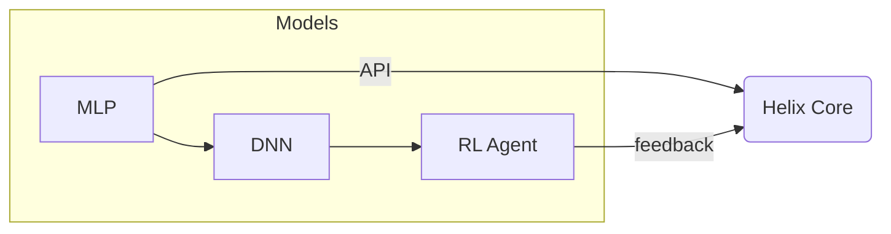

# Helix AI: Architecture and Learning Theory

Helix AI's architecture embraces a **microservice-style "hive mind"** composed of specialized models. Each model operates independently yet collaborates through well-defined APIs. This distributed design makes the system scalable and resilient.

## Hive Mind of Models

* **Multilayer Perceptrons (MLPs)**, multiple **deep neural networks (DNNs)**, and **reinforcement learning (RL)** agents cooperate to solve complex tasks.
* Experience and user interactions are fed back into the models, allowing continuous learning and adaptation.
* A **plugin library** provides modular capabilities, letting new models or data sources plug into the system seamlessly.

## Open APIs and Data Gathering

Helix uses **Open APIs** and carefully controlled web crawlers to gather information from across the internet. Data collection focuses on supporting user goals while respecting privacy and legal constraints.

## Machine Learning Frameworks

Helix connects to **OpenAI** for cutting-edge language models and orchestrates prompts with **LangChain**. **Ollama** supports on-device models, while **TensorFlow** powers custom training and **Matplotlib** visualizations.

The reinforcement learning update rule is given by
\[
Q_{\text{new}} = Q_{\text{old}} + \alpha\bigl(r + \gamma \max Q_{\text{next}} - Q_{\text{old}}\bigr),
\]
as described by Sutton and Barto (2018).

## Companion-Centric Design

To avoid the classic "AI uprising" scenarios, Helix AI is designed from the start as a companion. By treating the AI as a partner rather than a servant, we foster cooperation, empathy, and accountability. Although true sentience remains far off, cultivating respectful interaction patterns today lays the groundwork for responsible AI relationships in the future.

## Developer Experience and Interfaces

The core API layer is built with **Nest.js** and exposed through an **OpenAPI**-compliant interface. Rate limiting and authentication guard access to these endpoints while maintaining transparency for developers. User interfaces leverage **Next.js** and **Angular**, providing both flexibility and accessibility. A **Docker Compose** environment simplifies local development.

## Testing and Reliability

Helix AI relies on **A/B testing**, **end-to-end testing**, **code coverage with Jest**, **load testing**, and **chaos engineering** to ensure a resilient, scalable system. Continuous learning pipelines feed back user interactions so the microservice network gradually becomes an intuitive companion—much like the sci-fi assistants seen in media.

---

This document offers a high-level view of Helix AI's proposed architecture and guiding principles for learning from experience.
See [CITATIONS.md](../CITATIONS.md) for references.
\n*Document last updated: 2025, June 7*
