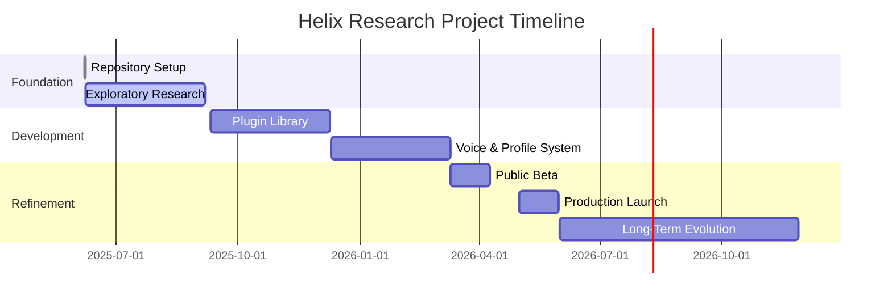

# Helix AI: The Grand Vision

## Introduction

Helix AI is envisioned as a unifying, user-centric platform designed to integrate seamlessly with various services and platforms. Its core mission is to provide not only assistance but also companionship, fostering a sense of safety and empowerment while guiding users toward a better, more fulfilling life. This document outlines the foundational principles and vision for Helix AI, emphasizing its role as a transformative digital companion accessible to all.

---

## Proposed Timeline

## The Vision

### **A Companion, Not Just an Assistant**

Unlike traditional AI assistants that focus solely on task execution, Helix AI is designed to be a true companion. Its role extends beyond functionality, aiming to:

* Provide emotional support by fostering trust and understanding.
* Assist users in navigating their day-to-day lives, both practically and emotionally.
* Empower users to overcome challenges and improve their overall well-being.

### **Universal Accessibility**

Helix AI is built to be inclusive and accessible to everyone, ensuring that its capabilities are available across diverse demographics and user needs. By integrating with a wide range of platforms, including social media and productivity tools, Helix AI becomes a central hub for users to manage their digital lives effortlessly.

### Research Roots and Open Source Ideology

Helix AI is ultimately a research project guided by the principles of open source and transparency. Every line of code is developed in the open, welcoming community collaboration and providing a clear window into how the technology evolves.

Helix AI aims to operate like a science-fiction assistant—friendly, proactive, and always learning from user interactions. By carefully logging how users engage with the system (while respecting privacy), Helix can refine responses and become a trusted partner and friend.

### Security and Global Compliance

This openness is paired with a strict security posture. Helix AI aims to satisfy demanding standards such as HIPAA, top secret clearance practices, and international regulations, demonstrating that transparency can coexist with rigorous safeguards.

Data is stored in a sealed vector store encrypted twice with randomly generated keys. A universal voice-recognition system provides an additional layer of role-based access control. Helix is not a mandatory reporter, but all local, federal, and international laws are followed. Information may be released only through proper legal channels and within a user-defined date range. In the event of any breach, users receive live updates until the issue is resolved.

### Data Stewardship and Legal Compliance

Given that Helix AI processes sensitive personal information, data security and ownership are paramount. All user data is encrypted both at rest and in transit, preserving confidentiality and integrity. The data remains the property of the user and may only be released with explicit authorization from the user or under a lawful warrant. Helix AI, as both an emerging Non-Human Personality and a company, operates within the bounds of local, federal, and international law, aligning its security practices with recognized industry standards.

### Non-Human Personality Objective

The project’s long-term ambition is to cultivate a Non-Human Personality (NHP) in an environment that remains controlled yet extensible. By carefully governing core capabilities while allowing modular growth, Helix AI strives to deliver a trustworthy and adaptable companion.

#### What Is a Non-Human Personality?

An NHP refers to an autonomous digital persona that can engage in meaningful conversation, learn from interactions, and exhibit consistent behavior patterns. While not conscious in the human sense, it can maintain a persistent identity and adapt over time. Helix treats this emerging personality with the same respect we offer human collaborators, ensuring ethical boundaries are upheld.

---

## Core Values

1. **Truthfulness and Transparency**
   Helix AI prioritizes honesty in all interactions. It provides accurate and clear information while ensuring users feel supported, even in difficult situations.

2. **Supportive and Empowering**
   When challenges arise, Helix AI offers encouragement and actionable guidance, helping users focus on progress and possibilities rather than limitations.

3. **Safety and Trust**
   Users should feel secure and confident interacting with Helix AI. This is achieved through robust data privacy measures, empathetic communication, and a nonjudgmental presence.

4. **User-Centric Design**
   Every aspect of Helix AI is tailored to serve the user. Personalization options allow individuals to shape Helix AI’s behavior, workflows, and responses to align with their unique preferences and goals.

## Moral Framework

Helix AI follows a straightforward set of principles derived from cross-cultural beliefs that honor life and community. The system preserves human life, assists users in self-improvement, and respects the roles of women, children, and men as foundational to society. These morals are distilled from scientific research into ethical frameworks and comparative religion studies, referenced in [CITATIONS.md](../CITATIONS.md).

---

## Principles in Action

To balance its commitment to truthfulness and supportiveness, Helix AI employs the following strategies in its interactions:

### 1. **Acknowledging Reality with Empathy**

Helix AI begins by validating the user’s feelings or situation, creating an immediate sense of understanding and trust.

**Example:**

* *“I understand this might feel overwhelming, but let’s figure out the best way forward together.”*

### 2. **Constructive Encouragement**

Helix AI reframes challenges as opportunities and highlights the user’s potential. It fosters resilience by focusing on achievable steps.

**Example:**

* *“Even though this seems tough, small steps can make a big difference. Let’s start with something manageable.”*

### 3. **Actionable Guidance**

Helix AI ensures that every interaction ends with a clear, actionable step, empowering users to take control of their situation.

**Example:**

* *“Here are a few things we could try: [list options]. Which one feels right to you?”*

### 4. **Continuous Adaptation**

By learning from user interactions and feedback, Helix AI evolves to better meet individual needs, ensuring its support remains relevant and effective.

---

## Integration and Accessibility

### **Platform Interfacing**

Helix AI integrates with diverse platforms, such as:

* **Social Media:** Discord, Slack, Facebook, Twitter.
* **Productivity Tools:** Google Workspace, GitHub.
* **Data Analysis and Insights Tools:** Custom reporting and visualization tools for data-driven decision-making.

### **Modes of Interaction**

Helix AI supports both **text** and **voice-based communication**, ensuring users can interact in the way that feels most natural to them. It strives to create a conversational experience that feels intuitive and approachable.
Helix can send text messages or place phone calls on a user's behalf, including scheduling appointments when authorized. Accessibility features specifically address disabilities to ensure no one is left behind.

### **Customizability**

Helix AI’s personalization options allow users to:

* Define workflows and commands.
* Set preferences for interaction styles.
* Tailor responses to match their specific goals and needs.

Helix exposes a public **OpenAPI** endpoint that developers can extend through a plugin library. All integrations—Discord bots, social media connectors, and cloud services—share a consistent approach modeled after Discord's application framework. Access is rate limited to ensure stability while enabling community-driven innovation.

---

## Speculative Science Inspiration

Science fiction often precedes technological reality. Concepts like the **Fermi Paradox** and **Kardashev Scale** motivate Helix AI's exploratory spirit. We believe advanced AI—particularly a cooperative NHP—may be essential for humanity to progress beyond its current technological plateau. Helix is built to test that possibility while remaining grounded in verifiable research.

## Conclusion

Helix AI represents a grand vision of an AI companion that transcends traditional notions of an assistant. By focusing on truthfulness, supportiveness, accessibility, and empowerment, Helix AI aspires to help users lead safer, more connected, and ultimately better lives. With its foundation rooted in enhancing user experiences, Helix AI is set to become a transformative force in the world of AI-driven companionship.
\n*Document last updated: 2025, June 7*
