# Project Overview

## 🧠 Helix AI

- **Type**: SaaS / PaaS
- **Goal**: An intelligent, emotionally aware virtual companion that helps users in their day-to-day tasks and life, not just as an assistant, but as a long-term partner.
- **Design**:

  - Built as a **monorepo**: `Helix-AI`
  - Uses a **custom LLM** and integrates public models via **Hugging Face**, **APIs**, and **files**
  - Plans for **platform integration**: Discord, Slack, Google, GitHub, Twitter, Facebook, etc.
  - Supports **text and voice interfaces**
  - Feeds on real-time **telemetry, logs, and system events** to be self-aware of the underlying platform and its components
  - Will leverage **data streams, caches, databases, object stores** for awareness, context, and learning

## 🛠 SinLess-Games-IaC

- **Purpose**: Manages infrastructure-as-code, security, policies, and DevSecOps pipelines
- **Structure**:

  - Separate Git repo: `SinLess-Games-IaC`
  - Contains:

    - Kubernetes (`clusters/`, `apps/`, `charts/`)
    - Terraform (`terraform/`)
    - Ansible (`ansible/`)
    - Docker (`docker/`)
    - Observability, policies, chaos, backups, documentation, scripts, and changelogs
    - Version tracking (`versions.json5`)
    - Logging utilities (`scripts/utils/logging.sh`)
    - Versioning scripts (`scripts/versioning/*.sh`)

---

[](https://www.xenonstack.com/insights/guide-devsecops-pipeline)

## DevSecOps Pipeline: Developer to Client Flow

```mermaid
---
id: cacb6d48-c468-49b0-8792-864a88931b95
title: "DevSecOps Pipeline: Developer to Client Flow"
---
%% Name of chart is "DevSecOps Pipeline: Developer to Client Flow"
%% This chart illustrates the flow from developer commits to client-side deployment, including pre-commit checks, CI/CD processes, and canary deployments.

flowchart LR
    %% Developer Commits Code
    A[Developer 🧑‍💻] -->|Commit & Push 📤| B[Pre-commit 🧹]
    %% Pre-commit checks (linting, formatting, security)
    B -->|Pass| C[Lint-staged ⚙️]
    %% Code passes linting, further checks
    C -->|Pass| D[CI Pipeline 🔄]
    %% Continuous Integration (build & test)
    D -->|Pass| E[Staging Deployment 🎯]
    %% Deploys to staging for further testing (load, E2E, etc.)
    E -->|Pass| F[Canary Deployment 🐤]
    %% Deploys to production, initially with limited users
    F -->|Pass| G[Production Deployment 🚀]
    %% Canary deploys to a subset of users to verify functionality
    G -->|Success| H[Full Rollout 🌍]
    %% Full deployment to all users if canary is successful
    H --> I[Client-side Deployment 🌐]
    %% Final deployment to the client-side, making the application available to all users

    %% Failure Paths
    %% Any failure in the pipeline returns the process to the Developer step (A)
    B -->|Fail| A
    C -->|Fail| A
    D -->|Fail| A
    E -->|Fail| A
    F -->|Fail| A
    G -->|Fail| A
    H -->|Fail| A

    %% Classify failure paths for clarity and process review
    class B,C,D,E,F,G failure;

    %% Comments:
    %% - Pre-commit checks include linting, formatting, and security scanning to ensure code quality.
    %% - The CI pipeline involves automatic building and testing of the code to prevent breaking changes.
    %% - Canary deployment allows the release to a small user group before full production deployment.
    %% - Alerts and versioning are crucial for monitoring deployment success and tracking changes.
    %% - If any stage fails, the commit is sent back to the developer (A) for fixes, ensuring quality code.

```

<!-- [MermaidChart: cacb6d48-c468-49b0-8792-864a88931b95] -->



## Detailed Process Breakdown

### 1. Pre-commit: Linting, Formatting, Security Checks, and Tests 🧹🔒

- **Purpose**: Ensures that code adheres to quality standards and is secure before being committed.
- **Tools**: ESLint, Prettier, SonarQube, Brakeman, OWASP Dependency-Check.
- **Failure Handling**: If any check fails, the commit is rejected, and the developer is prompted to fix the issues.

### 2. Commit & Push: GitHub / GitLab Triggers 📤

- **Purpose**: Developer commits and pushes code to the repository, triggering the CI pipeline.
- **Failure Handling**: If the commit or push fails, the developer is notified to resolve the issue before proceeding.

### 3. Continuous Integration (CI): Linting, Security Scanning, Build Tests 🔄

- **Purpose**: Automates the integration of code changes, running tests and security scans.
- **Tools**: Jenkins, GitLab CI, Snyk, WhiteSource, Jest, JUnit, pytest.
- **Failure Handling**: Any failure in tests or security scans causes the pipeline to fail, and the developer is alerted to address the issue.

### 4. Staging Deployment: Load Testing, E2E Tests, Canary Deployment 🎯

- **Purpose**: Deploys code to a staging environment for further testing and validation.
- **Tools**: Kubernetes, Docker, Cypress, Selenium, JMeter.
- **Failure Handling**: If any test fails or performance thresholds are not met, the deployment is halted, and the code is returned to development.

### 5. Production Deployment: Canary → Full Rollout with Automated Rollback 🚀

- **Purpose**: Deploys code to production in stages, starting with a canary release.
- **Tools**: Kubernetes, Helm, AWS CodeDeploy.
- **Failure Handling**: If the canary deployment fails, the system automatically rolls back to the previous stable version.

### 6. Alerts: Sent via Discord, Email, and SMS 🔔

- **Purpose**: Notifies stakeholders of deployment status and issues.
- **Tools**: PagerDuty, Slack, Email.
- **Failure Handling**: If alerts fail, logs are generated for further investigation.

### 7. Versioning: Patch/Minor/Major Bumps Tracked 📦

- **Purpose**: Manages versioning of the application using semantic versioning.
- **Tools**: Git tags, npm, pip, go.mod, Poetry.
- **Failure Handling**: If versioning is incorrect, the pipeline fails, and the developer is prompted to correct the version details.

## Technology Stack

- **Languages**: TypeScript, Python, Rust, Lua, Go, Ruby, C++, C#.
- **Package Management**: asdf, pnpm, Poetry, go.mod.
- **Version Control**: GitHub, GitLab.
- **CI/CD Tools**: Jenkins, GitLab CI, AWS CodePipeline.
- **Deployment Tools**: Kubernetes, Docker, Helm, AWS CodeDeploy.
- **Monitoring and Alerts**: Prometheus, Grafana, PagerDuty, Slack.

---

## 🧱 Infrastructure Setup

Helix AI operates on a cloud-native, resilient, and scalable architecture. Below is a categorized breakdown of all key technologies, each with a description of how it’s used within Helix and a link to its documentation.

## 🛠 Technologies Used

### ⚙️ Kubernetes & Orchestration

- **[RKE2](https://docs.rke2.io/)**
  Helix’s control plane runs on RKE2 to enforce enterprise-grade security, compliance, and simplified lifecycle operations across all clusters.
- **[K3s](https://docs.k3s.io/)**
  Edge-oriented microservices and IoT workloads are deployed on K3s nodes for minimal overhead and rapid provisioning at remote sites.
- **[FluxCD](https://fluxcd.io/docs/)**
  Application manifests in Git are continuously reconciled to the cluster state by FluxCD, ensuring declarative, GitOps-driven delivery of Helix’s microservices.
- **[Karmada](https://karmada.io/docs/)**
  Helix spans dev, staging, and prod clusters across regions; Karmada federates these clusters, enabling unified multi-cluster policy enforcement and traffic routing.
- **[Helm](https://helm.sh/docs/)**
  Each Helix service is packaged as a Helm chart, allowing versioned rollouts and rollbacks of complex application stacks with a single command.
- **[Rook](https://rook.io/docs/rook/latest-release/)**
  Stateful components—like Ceph backing for object and block storage—are orchestrated via Rook operators, automating storage lifecycle and scaling.
- **[Vitess](https://vitess.io/docs/)**
  High-volume transactional workloads in Helix are sharded across MySQL instances using Vitess, providing horizontal scalability and seamless schema migrations.
- **[KEDA](https://keda.sh/docs/)**
  Event-driven workloads (e.g., background jobs) scale elastically by KEDA, which watches Kafka topics and Redis streams to adjust pod replicas.
- **[Crossplane](https://docs.crossplane.io/)**
  Cloud resources—databases, message queues, object buckets—are declared as Kubernetes CRDs and managed alongside apps via Crossplane.
- **[Metrics Server](https://kubernetes-sigs.github.io/metrics-server/)**
  Horizontal and vertical pod autoscalers query Metrics Server for real-time CPU/memory usage to make scaling decisions.
- **[Kube-State-Metrics](https://github.com/kubernetes/kube-state-metrics)**
  Detailed Kubernetes object metrics (deployments, daemonsets, nodes) feed into Helix’s Grafana dashboards for capacity planning.
- **[Node Exporter](https://github.com/prometheus/node_exporter)**
  Host-level metrics (disk I/O, network, CPU) are scraped from each node, enabling cluster health alerts and cost-optimization analysis.
- **[cAdvisor](https://github.com/google/cadvisor)**
  Container performance metrics (per-pod CPU, memory, filesystem) are collected via cAdvisor and ingested into Prometheus for resource-usage insights.

### 🔄 CI/CD & Policy

- **[GitHub Actions](https://docs.github.com/en/actions)** / **[GitLab CI](https://docs.gitlab.com/ee/ci/)**
  Builds, tests, and image pushes occur via hosted runners, triggering FluxCD-driven deployments on merge to `main`.
- **[Flagger](https://docs.flagger.app/)**
  Canary and blue/green rollouts for critical Helix services are orchestrated by Flagger, automatically promoting or rolling back based on metrics.
- **[Kyverno](https://kyverno.io/docs/)** / **[OPA](https://www.openpolicyagent.org/docs/latest/)**
  Policy-as-code enforces security standards (e.g., disallowed images, namespace quotas) before resources are admitted to the cluster.
- **[Snyk](https://docs.snyk.io/)**
  Continuously scans Helix’s container images and code dependencies for vulnerabilities, blocking unsafe builds in the pipeline.
- **[Renovate](https://docs.renovatebot.com/)**
  Automated dependency updates for all Helix repositories, raising PRs with tested upgrades to keep libraries current and secure.
- **[Mend (formerly WhiteSource)](https://docs.mend.io/)**
  Provides comprehensive open-source risk management, license compliance, and policy enforcement across Helix’s software supply chain.
- **[MeticulousAI](https://www.meticulous.ai/docs/)**
  AI-driven code review that detects potential bugs, performance issues, and security flaws in Helix’s pull requests.
- **[CodeQL](https://codeql.github.com/docs/)**
  Semantic code analysis for deep vulnerability detection, integrated into CI to prevent regressions in Helix’s microservices.
- **Dependabot (GitHub)**
  GitHub’s native dependency update tool, complementing Renovate for critical package updates in Helm charts and workflows.
- **WhiteSource Bolt**
  Quick vulnerability scanning for .NET, JavaScript, Python, and other projects in Helix’s monorepo.

### 📊 Observability Stack

- **[Fluentd](https://docs.fluentd.org/)** / **[Loki](https://grafana.com/docs/loki/latest/)** / **[Logstash](https://www.elastic.co/guide/en/logstash/current/index.html)**
  Application and infrastructure logs are aggregated, enriched, and indexed for troubleshooting across Helix’s microservices.
- **[Prometheus](https://prometheus.io/docs/introduction/overview/)** / **[Grafana](https://grafana.com/docs/grafana/latest/)** / **[Alertmanager](https://prometheus.io/docs/alerting/latest/alertmanager/)**
  Metrics are scraped and visualized; Alertmanager routes incidents to Slack and Discord channels.
- **[Jaeger](https://www.jaegertracing.io/docs/)** / **[Tempo](https://grafana.com/docs/tempo/latest/)**
  Distributed traces capture request flows through Helix’s API gateway and services, aiding performance tuning.
- **[OpenTelemetry](https://opentelemetry.io/docs/)**
  Unified instrumentation library ensures consistent metrics, traces, and logs across all Helix components.
- **[Pyroscope](https://pyroscope.io/docs/)**
  Continuous profiling of CPU and memory hotspots in Helix services to optimize performance and reduce costs.
- **[Grafana SLO](https://grafana.com/docs/grafana/latest/observability/slo/)** / **[Grafana Incident](https://grafana.com/docs/incident/latest/)**
  Service level objectives and incident management dashboards track Helix’s SLA compliance.
- **[Kiali](https://kiali.io/docs/)**
  Visualizes Istio service mesh topology, traffic distribution, and identifies mesh misconfigurations within Helix.
- **[Wazuh](https://documentation.wazuh.com/current/index.html)**
  Security events from containers and hosts are analyzed for intrusion detection and compliance auditing.
- **[Beats](https://www.elastic.co/guide/en/beats/libbeat/current/index.html)**
  Filebeat ships application logs; Metricbeat ships host and service metrics to the ELK stack.
- **[Alertmanager Discord Notifier](https://github.com/prometheus/alertmanager/blob/main/docs/configuration.md#discord-receiver)**
  Routes critical alerts into designated Discord channels for on-call teams.

### 🔐 Networking & Security

- **[NGINX Ingress Controller](https://kubernetes.github.io/ingress-nginx/)**
  Manages external HTTP(S) traffic, TLS termination, and virtual hosts for Helix’s public APIs.
- **[Cloudflare](https://developers.cloudflare.com/)** + **[cloudflared](https://developers.cloudflare.com/cloudflare-one/connections/connect-apps/)**
  Zero-trust tunnels securely expose internal Helix dashboards without public IPs.
- **[ExternalDNS](https://kubernetes-sigs.github.io/external-dns/)**
  Automatically maps Kubernetes Ingress and Service records to DNS entries in Cloudflare and AWS Route 53.
- **[Istio](https://istio.io/latest/docs/)** / **[Citadel](https://istio.io/latest/docs/tasks/security/authentication/)**
  Provides mTLS, traffic routing rules, and policy controls across Helix’s microservices mesh.
- **[SPIFFE](https://spiffe.io/docs/)** / **[SPIRE](https://spiffe.io/spire/)**
  Issues workload certificates for secure identity propagation between services.
- **[Falco](https://falco.org/docs/)**
  Runtime security agent detects abnormal container behavior within Helix.
- **[Cert-Manager](https://cert-manager.io/docs/)**
  Automates provisioning and renewal of TLS certificates for all Helix domains.
- **[Vault](https://www.vaultproject.io/docs)**
  Centralizes secret storage (API keys, DB credentials) with dynamic leasing in Helix.
- **[Pi-hole](https://docs.pi-hole.net/)**
  DNS sinkhole to block malicious traffic originating from container builds and CI pipelines.
- **[Gateway API](https://gateway-api.sigs.k8s.io/)**
  Advanced HTTP/TCP routing for multi-tenant ingress traffic.
- **[Cilium](https://docs.cilium.io/en/stable/)**
  eBPF-powered networking and network policy enforcement for high-performance clusters.
- **[Consul](https://developer.hashicorp.com/consul/docs)**
  Service catalog and mesh for non-HTTP protocols used by Helix’s legacy components.
- **[Tyk](https://tyk.io/docs/)**
  API gateway enforcing rate limits, authentication, and analytics for Helix’s external APIs.

### 🌐 Cloud Providers

- **[AWS](https://aws.amazon.com/)** / **[GCP](https://cloud.google.com/)** / **[Azure](https://azure.microsoft.com/)**
  Core compute, managed databases, and networking services hosting Helix’s production workload.
- **[Cloudflare](https://www.cloudflare.com/)**
  CDN, DDoS protection, DNS and WAF at the edge for Helix’s public endpoints.
- **[Linode](https://www.linode.com/docs/)** / **[DigitalOcean](https://www.digitalocean.com/docs/)** / **[OVHcloud](https://www.ovhcloud.com/en/)**
  Secondary regions and cost-optimized dev/test environments.
- **[Scaleway](https://www.scaleway.com/en/docs/)**
  European GDPR-compliant object storage and bare-metal instances.
- **[CoreWeave](https://www.coreweave.com/)** / **[Lambda Labs](https://lambdalabs.com/)** / **[Paperspace](https://www.paperspace.com/docs/)** / **[RunPod](https://www.runpod.io/)**
  GPU-accelerated instances for Helix’s model training and inference workloads.

### 📈 Prometheus Exporters

- **[Node Exporter](https://github.com/prometheus/node_exporter)**
  Scrapes host-level CPU, memory, disk I/O, and network statistics from each Kubernetes node.
- **[Kube-State-Metrics](https://github.com/kubernetes/kube-state-metrics)**
  Exposes metrics about the state of Kubernetes objects (deployments, pods, daemonsets, etc.) for capacity planning.
- **[Metrics Server](https://kubernetes-sigs.github.io/metrics-server/)**
  Aggregates real-time CPU and memory usage from pods and nodes to power autoscaling.
- **[cAdvisor](https://github.com/google/cadvisor)**
  Monitors container resource usage (CPU, memory, filesystem) and exports those metrics to Prometheus.
- **[Blackbox Exporter](https://github.com/prometheus/blackbox_exporter)**
  Probes endpoints over HTTP, DNS, TCP, and ICMP to measure availability, latency, and correctness.
- **[MySQL Exporter](https://github.com/prometheus/mysqld_exporter)**
  Collects performance and status metrics (queries/sec, connections, slow queries) from MySQL instances.
- **[Redis Exporter](https://github.com/oliver006/redis_exporter)**
  Exposes Redis server metrics (hits, misses, memory usage, operation latency) for caching layer insights.
- **[CockroachDB Exporter](https://github.com/cockroachdb/cockroachdb-prometheus-exporter)**
  Provides metrics on CockroachDB cluster health (latencies, replication factors, range counts).
- **[InfluxDB Exporter](https://github.com/prometheus/influxdb-exporter)**
  Scrapes InfluxDB internal statistics (write throughput, query performance, retention stats) for TSDB monitoring.

  _All exporters feed Helix’s central Prometheus for unified alerting and capacity planning._

### ✉️ Mail & Notification

- **[Mailu](https://mailu.io/1.7/)**: Self-hosted SMTP/IMAP for Helix system emails.
- **[Alertmanager](https://prometheus.io/docs/alerting/latest/alertmanager/)**: Routes alerts to Slack, PagerDuty, and Discord.
- **[Alertmanager Discord Notifier](https://github.com/prometheus/alertmanager/blob/main/docs/configuration.md#discord-receiver)**
- **[Twilio](https://www.twilio.com/docs/)** – SMS via Twilio Notify for critical Helix alerts.

### 💾 Storage

- **[MinIO](https://min.io/docs/minio/)**: Object storage for artifacts and bulk data.
- **[CockroachDB](https://www.cockroachlabs.com/docs/stable/)**: Globally distributed SQL for Helix’s metadata.
- **[PostgreSQL](https://www.postgresql.org/docs/)** / **[MongoDB](https://www.mongodb.com/docs/)**: Service-specific data stores.
- **[Redis](https://redis.io/docs/)**: Caching and ephemeral queues.
- **[InfluxDB](https://docs.influxdata.com/influxdb/)**: Time-series storage for custom metrics.
- **[Amazon S3](https://docs.aws.amazon.com/s3/index.html)** / **[Cloudflare R2](https://developers.cloudflare.com/r2/)**: Long-term archives and zero-egress object hosting.

### ♻️ Backup & Recovery

- **[Velero](https://velero.io/docs/)**: Scheduled backups of cluster resources and persistent volumes.

### 💰 Cost Management

- **[Kubecost](https://docs.kubecost.com/)** / **[OpenCost](https://opencost.io/docs/)**: Real-time Kubernetes cost attribution and optimization.

### 🧠 AI Stack

- **[Ollama](https://ollama.ai/docs)**: On-device LLM inference for low-latency chat features.
- **[Whisper](https://github.com/openai/whisper)** / **[Faster-Whisper](https://github.com/guillaumekln/faster-whisper)**: Speech-to-text processing.
- **[Wyoming-Piper](https://github.com/rhasspy/piper)**: Neural TTS for voice assistants.
- **[Stable Diffusion](https://github.com/CompVis/stable-diffusion)**: Image generation for creative features.
- **[SearxNG](https://docs.searxng.org/)**: Privacy-focused metasearch integration.

---

## 🥪 SIEM Stack (Planned)

To ensure deep security visibility and incident response readiness, Helix AI will integrate a dedicated Security Information and Event Management (SIEM) stack. This is critical for proactive detection, real-time alerting, forensic analysis, and compliance auditing. Together, these components will form the backbone of Helix AI’s threat detection and response capability, ensuring compliance with industry standards (e.g., SOC 2, ISO 27001) and reducing Mean Time to Detection (MTTD) and Mean Time to Response (MTTR).

---

### 🔎 Core Components

- **[Wazuh](https://documentation.wazuh.com/current/)**
  Open-source security monitoring platform providing log analysis, file integrity monitoring, intrusion detection, and vulnerability scanning across containers, VMs, and bare-metal hosts.
- **Elastic Stack**
  Centralized logging, enrichment, search and visualization layer already in Helix’s observability pipeline, to be extended for SIEM use cases:

  - **[Elasticsearch](https://www.elastic.co/guide/en/elasticsearch/reference/current/index.html)** – Scalable time-series datastore for indexed security events.
  - **[Logstash](https://www.elastic.co/guide/en/logstash/current/index.html)** – Ingests, parses, and enriches logs from multiple sources (Wazuh, Beats, cloud).
  - **[Kibana](https://www.elastic.co/guide/en/kibana/current/index.html)** – Dashboards and ad-hoc querying for security analysts.

---

### 🛡️ Threat Detection & Intelligence

- **[Sigma](https://github.com/SigmaHQ/sigma)**
  Generic signature format for writing SIEM detection rules, translated into Elasticsearch queries for real-time alerting.
- **[TheHive](https://docs.thehive-project.org/)** & **[Cortex](https://docs.thehive-project.org/thehive/latest/cortex/)**
  Scalable incident response platform (“TheHive”) and automated analysis engine (“Cortex”) for case management, enrichment, and playbooks.
- **[Suricata](https://suricata.io/docs/)**
  High-performance network IDS/IPS that generates detailed security events (TLS, HTTP, DNS) forwarded to Elasticsearch via Logstash.

---

### 📄 Log Management & Parsing

- **[Graylog](https://docs.graylog.org/)**
  Alternative log management interface optimized for rapid search and alerting on structured security logs.
- **[Fluentd](https://docs.fluentd.org/)**
  Unified log forwarder for routing container, system, and cloud logs into the SIEM pipeline.
- **[Auditbeat](https://www.elastic.co/guide/en/beats/auditbeat/current/auditbeat-overview.html)**
  Beats module that collects Linux audit framework events (process exec, file changes, user login) for compliance reporting.

---

### 🌐 Network & Host Analysis

- **[Zeek](https://docs.zeek.org/en/current/)**
  Network security monitor that produces rich metadata on network flows, forwarded to Elasticsearch for threat hunting.
- **[OSQuery](https://osquery.readthedocs.io/en/stable/)**
  SQL-like querying of Linux, macOS, and Windows endpoints to detect configuration drift, running processes, and anomalous states.
- **[Security Onion](https://securityonion.net/docs/)**
  All-in-one distribution for intrusion detection, network security monitoring, and log management combining Zeek, Suricata, Wazuh, and Elasticsearch.

---

### ☁️ Cloud SIEM & Integration

- **[AWS Security Hub](https://docs.aws.amazon.com/securityhub/latest/userguide/what-is-securityhub.html)**
  Aggregates findings from AWS services (GuardDuty, Inspector) and custom rules into a central dashboard, forwarded to Elastic.
- **[Azure Sentinel](https://docs.microsoft.com/azure/sentinel/)**
  Cloud-native SIEM with built-in ML analytics and threat intelligence, integrated via Logstash or the Elastic Azure module.
- **[Google Chronicle](https://cloud.google.com/chronicle/docs/)**
  High-scale cloud SIEM for long-term retention of security telemetry, accessible alongside Helix’s Elastic index.

---

### 📈 Compliance & Reporting

- **[OpenSCAP](https://www.open-scap.org/resources/documentation/)**
  Automated compliance auditing against SCAP benchmarks (CIS, DISA, PCI) with reports ingested into Kibana.
- **[CIS-CAT Pro](https://www.cisecurity.org/cis-cat-pro/)**
  Commercial compliance scanner for in-depth OS and application configuration assessments.

---

### 🔗 Additional Tools & Integrations

- **[MISP](https://www.misp-project.org/)** – Threat-sharing platform for ingesting IOCs and threat intelligence feeds.
- **[Falco](https://falco.org/docs/)** – Runtime container security that emits system-call based alerts to the SIEM.
- **[STIX/TAXII](https://oasis-open.github.io/cti-documentation/)** – Standardized sharing of threat intelligence, automated ingestion into Elasticsearch.

---

By combining these components, Helix AI’s SIEM stack will deliver end-to-end visibility—from low-level network events to high-level incident management—ensuring rapid detection, efficient investigation, and robust compliance reporting.

---

## 🧾 Configuration Practices

Helix AI enforces modern configuration and deployment methodologies to ensure consistency, repeatability, and security across its environments. These practices support operational resilience and developer agility while maintaining rigorous policy compliance.

- **Configuration as Code**: All application, infrastructure, and policy settings are declaratively defined in version-controlled code repositories. This guarantees traceability and enables auditable changes.

- **Infrastructure as Code (IaC)**: Tools like Terraform, Ansible, Helm, and FluxCD are used to provision, manage, and continuously reconcile infrastructure resources programmatically. Terraform and Ansible handle declarative provisioning and configuration, while Helm packages Kubernetes workloads for repeatable deployment. FluxCD introduces GitOps workflows, enabling automatic synchronization between Git repositories and the desired state of Kubernetes clusters, reducing drift and ensuring consistent, auditable deployments.

- **Zero Trust Model**: The Helix architecture assumes breach by default. Authentication, authorization, and encryption are enforced at every layer. Each service is independently authenticated and least-privilege communication is implemented through SPIFFE/SPIRE and Istio mTLS. In line with this principle, Helix enforces the concept of **Least Required Permissions**: all services, users, and components operate with the minimum set of permissions necessary to perform their tasks. API tokens are granted with only the specific scopes required, and access is continuously reviewed. This minimizes the blast radius of any potential breach and limits exposure to sensitive resources. Additionally, all user accounts and admin interfaces require MFA/2FA authentication, ensuring that identity is verified using strong, multi-factor credentials across the platform.

- **Security & Policy as Code**: Helix integrates both security and policy-as-code practices to enforce operational, compliance, and access controls throughout its lifecycle. Using tools like Kyverno and Open Policy Agent (OPA), security policies and compliance rules are declaratively defined and managed in version-controlled repositories. These policies enforce role-based access controls (RBAC), restrict container registries, validate resource configurations, and ensure namespace quotas are respected—automatically rejecting misconfigured resources at admission time. Integrating these rules into CI/CD pipelines ensures consistent, testable enforcement across all clusters. Secrets and certificates are centrally managed using tools like Vault (for dynamic secrets), SOPS and age (for encrypted configuration files), and GPG (for secure communications and identity verification). TLS provisioning and rotation is automated using Cert-Manager and OpenSSL. This combination forms a secure supply chain that minimizes risk exposure and maximizes compliance. This dual-pronged approach improves auditability, eliminates human error, and creates a transparent, automated security posture that adapts as infrastructure evolves.

## 🥪 Cluster Environments

- **Staging Cluster**: A fully-featured replica of the production environment, the staging cluster is used for rigorous validation and testing. It serves as a sandbox for:

  - End-to-end (e2e) testing
  - Load and stress testing
  - Security scanning
  - Deployment and CI pipeline validation
  - Chaos engineering and fault injection
  - Integration and acceptance tests
    This environment helps prevent regressions and performance issues before they reach production.

- **Production Cluster**: This is the live, customer-facing environment where Helix AI is deployed for real-world use. It is also used for controlled chaos testing to validate system resilience and recovery processes in production. This includes fault injection, resource exhaustion, and network partition simulations designed to surface weaknesses before real users experience them. It is:

  - Hardened with least-privilege RBAC and network policies
  - Continuously monitored for performance and security
  - Backed by high availability (HA) infrastructure
  - Equipped with automatic failover, disaster recovery, and frequent backups
    The production cluster handles active user sessions, API traffic, and inference workloads, making its stability and security paramount.

## 🧎 Versioning

Helix AI is composed of independently developed and deployed microservices, each with its own lifecycle. To support this architecture, each microservice manages its own versioning using files appropriate to its technology stack. For example:

- **JavaScript/TypeScript/Node.js** services use `package.json`
- **Python** services use `Pipfile`
- **Go** services use `go.mod`

These version files are located within the respective service directories and track not only the version of the service but also its dependencies. This ensures alignment with the service’s language ecosystem and enables independent updates without tightly coupling all services.

To maintain transparent documentation of changes, Helix uses structured changelogs stored under:

```sh
docs/changelogs/{app_or_component_name}/Changelog_{date}_{Version}.md
```

Each changelog file records detailed release notes for its respective service, including:

- Commit messages that provide a summary of the work completed

- A list of files that were changed, added, or removed during the release

- Contextual details about the purpose and impact of each change

- New features

- Bug fixes

- Security updates

- Breaking changes

- Performance enhancements

This naming and path convention supports granular traceability, allowing teams to audit the history of any service and understand the scope of every release.

To streamline version management, Helix provides dedicated scripts for bumping versions according to semantic versioning (SemVer). These include:

- **Patch bump scripts** for bug fixes and maintenance
- **Minor bump scripts** for backward-compatible enhancements
- **Major bump scripts** for incompatible changes

Each script automates the process of updating the service's version metadata, tagging the Git repository, and optionally publishing releases. In addition, a comprehensive release script is available to:

- Update the changelog with templated release notes
- Package and distribute artifacts
- Trigger downstream CI/CD pipelines for deployment

This cohesive tooling guarantees consistency across the platform and reduces manual overhead while ensuring that all updates are traceable, well-documented, and automatically propagated through the deployment lifecycle.

## ✅ Observability Map

Helix AI incorporates an extensive observability strategy across its entire stack to ensure visibility, traceability, and rapid incident response. This includes not only comprehensive telemetry collection but also real-time alerting, automated analysis, and intuitive visualization layers.

A visual observability map illustrates the flow of metrics, logs, traces, and events throughout the Kubernetes-based infrastructure. It includes components such as:

- **Load Balancers**: Ingress traffic flows from edge nodes or CDNs into internal services.
- **Master Nodes**: Run Kubernetes control plane services like the API server, scheduler, and controller manager.
- **Worker Nodes**: Host Helix microservices, sidecars, and observability agents.
- **Monitoring Stack**: Prometheus scrapes metrics, Alertmanager dispatches alerts, and Grafana renders dashboards.
- **Logging Stack**: Fluentd/FluentBit and Logstash aggregates logs, Loki indexes them, and Grafana and kibana visualizes log data.
- **Tracing Infrastructure**: Jaeger or Tempo collect distributed traces, helping engineers track requests across services.
- **Service Mesh**: Istio and Cilium enables tracing, traffic shaping, and telemetry export from within the mesh.
- **Storage Backends**: Persistent volumes and object stores handle historical observability data retention.
- **Profiling:** Pyroscope continuously profiles Helix services to capture real-time insights into CPU and memory usage. These profiles help engineers identify inefficient code paths, memory leaks, and performance regressions before they escalate into user-facing issues. Profiling data is visualized in Grafana and integrated with other observability signals for a holistic performance overview.
- **SLOs:** Helix tracks Service Level Objectives (SLOs) across all major services to ensure reliability, responsiveness, and availability targets are consistently met. SLO dashboards display error rates, response times, and uptime percentages, helping teams stay proactive in maintaining SLA compliance. Alerts are automatically generated when metrics approach thresholds, preventing potential outages or regressions before they escalate.
- **Uptime Status Monitoring:** Helix maintains publicly accessible status pages that report current uptime, ongoing incidents, and historical reliability metrics. These dashboards are updated in real time, offering users full visibility into platform health. Transparency is further supported by periodic reliability reports and post-incident reviews, which are shared openly to build trust and ensure accountability.

Helix AI guarantees an uptime of 85–90% for the system, allowing the remaining 10–15% for essential downtime, maintenance, updates, or critical patching. This target ensures a balanced focus on reliability and the necessary operational overhead required to sustain long-term system health. Monitoring is conducted continuously, with alert thresholds and incident response procedures established to ensure minimal disruption.

To enforce this, Helix employs redundant systems, auto-healing Kubernetes deployments, active monitoring agents, and infrastructure-level backups. Detailed reports of downtime and root cause analyses are shared transparently with internal teams and stakeholders. With a seperate report created for the public.

 This system enables full transparency and real-time awareness of Helix's health and operational integrity. By aggregating logs, metrics, traces, and profiling data across all microservices and infrastructure components, Helix ensures actionable visibility into performance and incident response readiness. Detailed uptime reports, incident summaries, and historical reliability data are made available to users and internal teams alike, helping foster trust and accountability.

- Rapid detection of anomalies using log correlation, metric thresholds, and anomaly detection algorithms that help surface early signs of instability.
- Root cause analysis of outages through distributed tracing and contextual log inspection to isolate failure domains.
- Performance bottleneck identification via continuous profiling, latency dashboards, and resource usage trends.
- SLA/SLO compliance tracking through real-time dashboards, alerting systems, and budget exhaustion metrics, ensuring proactive action is taken to prevent SLA breaches.
- Transparent uptime reporting through publicly accessible dashboards and detailed incident logs for both internal teams and end users.
- Incident retrospectives and reliability summaries shared regularly to enhance user trust and internal processes.

By centralizing, contextualizing, and correlating telemetry across all clusters and services, Helix guarantees proactive issue detection, rapid root cause analysis, and efficient resource utilization. This comprehensive observability pipeline supports not only day-to-day operations but also long-term reliability engineering initiatives. Whether it's performance tuning in staging or uptime assurance in production, Helix applies consistent telemetry-driven workflows to ensure resilient, secure, and scalable operations.

```mermaid
graph TD
    %% Observability Stack with Telemetry Flow
    A[Edge Load Balancer 🌐] --> B[K8s Master Nodes 🧠]
    B --> C[K8s API Server 🖥️]
    B --> D[Scheduler 🗓️]
    B --> E[Controller Manager 🛠️]
    A --> F[Worker Nodes ⚙️]
    F --> G[Helix Microservices 🤖]
    G --> H[Sidecars & Observability Agents 🧪]
    G --> I[Service Mesh (Istio / Cilium) 🌐]
    G --> J[Prometheus Exporters 📊]
    H --> K[Log Collectors (Fluentd / Logstash) 📚]
    H --> L[Log Indexers (Loki / Kibana) 🔍]
    J --> M[Prometheus - Metrics Collector 📈]
    M --> N[Grafana Dashboards 📉]
    M --> O[Alertmanager - Incident Dispatcher 🚨]
    H --> P[Distributed Tracing (Jaeger / Tempo) 🧭]
    G --> R[Profilers (Pyroscope) 🧬]
    G --> S[SLO Trackers (Grafana SLO) 🎯]
    T[Persistent Volumes & Object Stores 💾] --> L
    T --> P
    T --> M
    T --> R

    %% Failure Paths
    F -->|Fail| G
    G -->|Fail| H
    H -->|Fail| K
    K -->|Fail| L
    J -->|Fail| M
    M -->|Fail| N
    N -->|Fail| O
    P -->|Fail| R
    R -->|Fail| S

    classDef failure fill:#ffcccc,stroke:#ff0000;
    class F,G,H,K,J,M,N,O,P,R,S failure;

```

This diagram captures the interaction between key observability components and how telemetry flows across the infrastructure.
